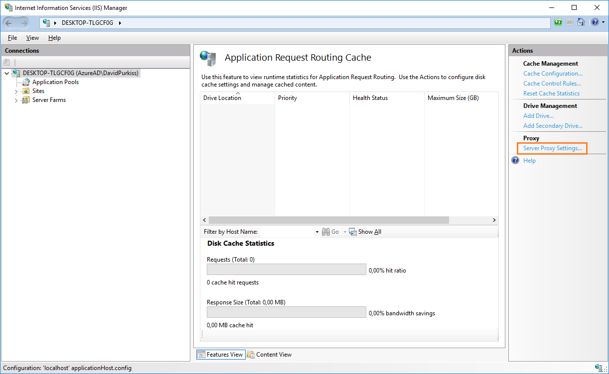
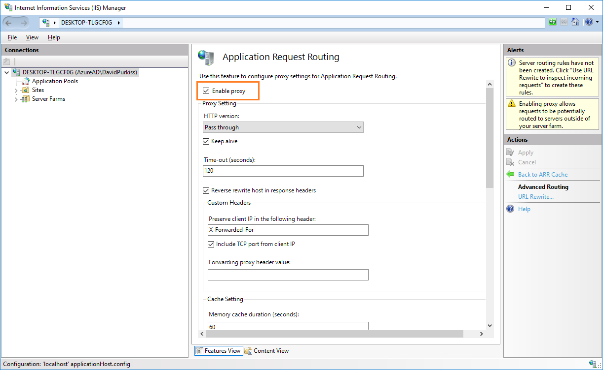

# Setup IIS Url Rewrite
OptoOne and Psibyl uses the IIS Url rewrite module to redirect traffic to the web applications on port 80 to their respective self-hosted services on other ports. In order for this to work correctly the following steps must be performed in a new unconfigured Windows machine.

## Install Url ReWrite module

[Download](https://www.microsoft.com/en-za/download/details.aspx?id=7435) the URL Rewrite Module 2.0 and isntall.

## Install Application Request Routing module

[Download](https://www.iis.net/downloads/microsoft/application-request-routing) the Application Request Routing module and install.

## Enable IIS proxy

* Open the IIS Manager and select the highest level root on the left.
* Oprn the 'Application Request Routing Cache' feature on the right.

* Then select 'Server Proxy Settings' in the Actions menu on the right.

* Make sure that the 'Enable proxy' check box is checked.

