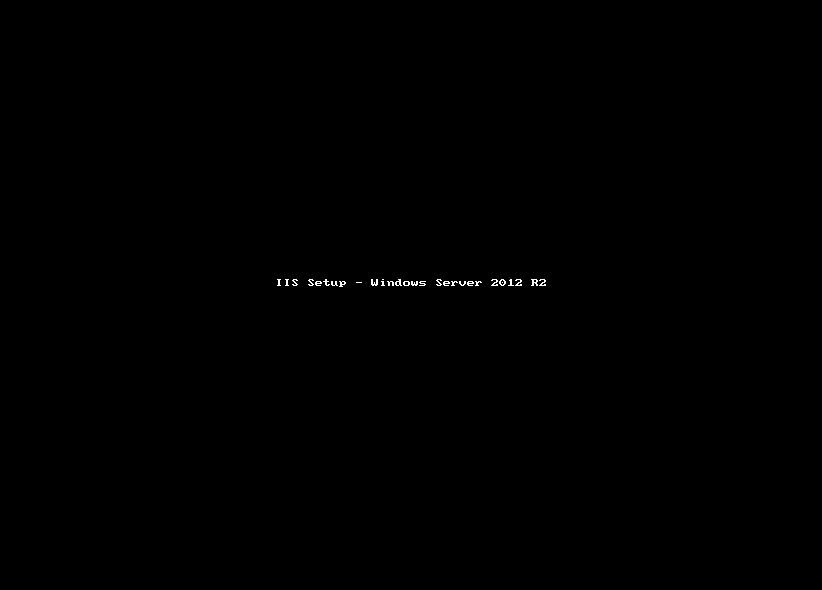
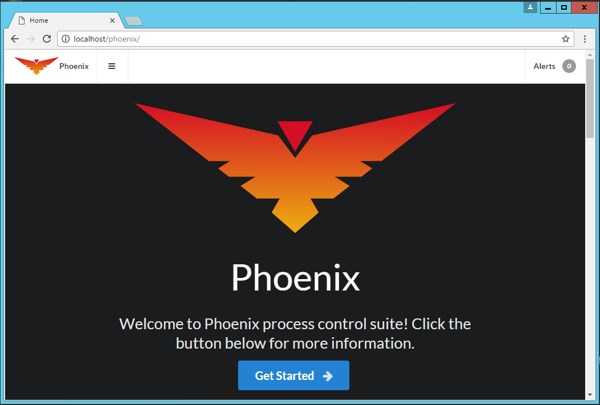

The following short manual will guide you through the setup process for a basic Phoenix installation on a single machine.

## Install IIS
Phoenix requires that IIS be installed and configured.
### Windows Server
From the server manager, add the Web Role and make sure that the `ASP.Net 4.5` and `WebSocket` features are selected.

 
### Windows 10
Add IIS from the "Program and Features". 

1. Right click start and select "Programs and Features" at the top.
2. Select "Turn Windows features on or off" on the left.
3. Make sure that the "Internet Information Services" is selected.
4. Make sure the features shown above in 'Windows Server` are selected.

## Install Phoenix
Run the Phoenix installer and follow the prompts. Allow all default settings for a basic setup on a single machine.

_*Note*:_ You may need to restart the machine after the installation is complete, especially if the .Net Framework was installed.

## Start the Phoenix Service
If you did not need to restart the machine, you will need to start the Phoenix service.

1. Enter, `Windows Key + R` 
2. Type in `services.msc`
3. Browse for the 'Phoenix' service.
4. Start the service if it is not already running.

## Test the Phoenix Service
Open up your browser and enter `localhost/phoenix` in the address bar. You should be greeted with the following screen.

